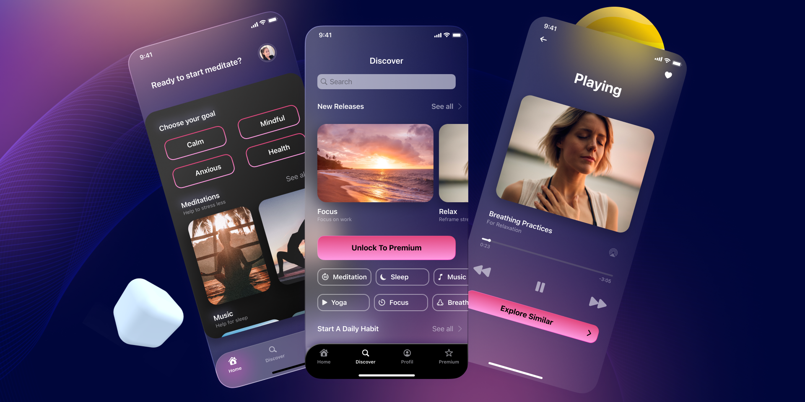

# R_meditate

**R_meditate** is an open-source Flutter UI project focused on meditation and relaxation.  
It provides a clean, modern, and modular user interface for meditation apps, including screens for home, discovery, player, premium, profile, and splash.

---

## 📱 Screenshots

<p align="center">
  
  
</p>

---

## 1. Summary

R_meditate is designed as a starting point or reference for building meditation and wellness apps using Flutter.  
It demonstrates best practices in UI structure, navigation, and state management, and is easy to extend for your own needs.

---
## 📁 Project Structure
 ```

learning_app/
│
├── lib/
│   ├── main.dart             # App entry point
│   ├── config/               # App-wide configuration (e.g., size_config.dart)
│   ├── constant/             # App constants (e.g., colors, strings)
│   ├── enum/                 # Enum definitions (e.g., view_state.dart)
│   ├── provider/             # Base models, view logic, dependency injection
│   │   ├── base_model.dart
│   │   ├── base_view.dart
│   │   └── getit.dart
│   ├── routes/               # Named route definitions
│   │   └── routes.dart
│   ├── service/              # App services (e.g., navigation)
│   │   └── navigation_service.dart
│   ├── src/
│   │   ├── screens/          # UI for each feature screen
│   │   │   ├── discover_screen/
│   │   │   │   ├── components/
│   │   │   │   └── discover_screen.dart
│   │   │   ├── home_screen/
│   │   │   │   ├── components/
│   │   │   │   └── home_screen.dart
│   │   │   ├── player_screen/
│   │   │   │   ├── components/
│   │   │   │   └── player_screen.dart
│   │   │   ├── premium_screen/
│   │   │   │   ├── components/
│   │   │   │   └── premium_screen.dart
│   │   │   ├── profile_screen/
│   │   │   │   ├── components/
│   │   │   │   └── profile_screen.dart
│   │   │   └── splash_screen/
│   │   │       ├── components/
│   │   │       └── splash_screen.dart
│   │   └── widgets/          # Shared/reusable widgets (e.g., bottom_nav_bar.dart)
│   ├── view/                 # View models for each screen
│   │   ├── discover_screen_view_model.dart
│   │   ├── home_screen_view_model.dart
│   │   ├── player_screen_view_model.dart
│   │   ├── premium_screen_view_model.dart
│   │   ├── profile_screen_view_model.dart
│   │   └── splash_screen_view_model.dart
│
└── ...                     

```

## 3. Main Dependencies

- [`flutter`](https://flutter.dev/) (UI framework)
- [`provider`](https://pub.dev/packages/provider) (state management)
- [`get_it`](https://pub.dev/packages/get_it) (dependency injection)
- [`flutter_native_splash`](https://pub.dev/packages/flutter_native_splash) (splash screen)
- [`flutter_lints`](https://pub.dev/packages/flutter_lints) (linting and code quality)

---

## 4. Installation

1. **Clone the repository:**
   ```sh
   git clone https://github.com/Amg2013/r_meditate.git
   cd r_meditate
   ```
2. **Install dependencies:**
   ```sh
   flutter pub get
   ```
3. **Run the app:**
   ```sh
   flutter run
   ```

---

## 5. Usage

- Explore the `lib/src/screens/` directory to find the UI code for each screen.
- Modify the code and hot-reload to see changes instantly.
- Integrate with your backend or add new features as needed.

---
---

## 🙏 Thanks

Special thanks to  <p sourany >for providing the free Figma design that inspired this UI.  
This project would not be possible without their creative work and generosity in sharing design resources with the community.

---
https://www.figma.com/design/Bx3MsemfhbsAwyHKkZS8u3/UI-Glassmorphism-app-Onboarding-Screen--Community-?node-id=411-236&p=f&t=CyGGKEA7aUNDEzQP-0


